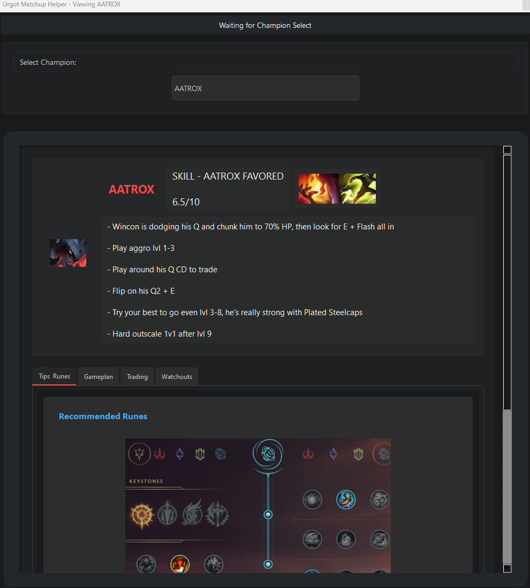

# Urgot Matchup Helper

A desktop application designed to provide urgots with suggestions on how to play the matchup. The app displays champion-specific matchup data, tips, and strategies from Quante's matchup bible. Important: This will not work if your connected google account does not have access to Quante's shared sheet.



## Features

- **Real-time Champion Detection**: Automatically detects enemy champions during champion select via the League Client API
- **Comprehensive Matchup Data**: Displays detailed matchup information including difficulty rating, trading tips, and gameplay advice
- **Interactive Interface**: User-friendly UI with champion search functionality
- **Ban Suggestions**: Recommends champions to ban based on difficult matchups
- **Manual Mode**: Allows manual lookup of any champion matchup outside of champion select
- **Always-on-top Mode**: Stays visible during champion select
- **Auto-reconnect**: Automatically reconnects to the League client when it's available

## System Requirements

- Python 3.8 or higher
- League of Legends client
- Internet connection for Google Sheets API

## Installation

### Standard Installation

1. **Clone or download the repository**:
   ```
   git clone https://github.com/yourusername/urgot-matchup-helper.git
   cd urgot-matchup-helper
   ```
   Or download and extract the ZIP file from the repository.

2. **Install dependencies**:
   ```
   pip install -r requirements.txt
   ```

3. **Set up Google Sheets API access**:
   - Go to the [Google Cloud Console](https://console.cloud.google.com/)
   - Create a new project
   - Enable the Google Sheets API
   - Create credentials (OAuth 2.0 Client ID)
   - Download the credentials JSON file and save it as `credentials.json` in the project root
   - On first run, you'll need to authorize the application to access your Google Sheets

4. **Configure the application** (optional):
   - If you want to use a different Google Sheet, set the `SHEET_ID` environment variable or modify the default in `src/data/google_sheets_manager.py`

### For Non-Technical Users

A standalone executable is planned for future releases, which will not require Python installation. Check the releases section for updates.

## Usage

### Starting the Application

Run the application:
```
python main.py
```

The application will:
1. Connect to the League client (if running)
2. Load matchup information from the Google Sheet
3. Show a waiting screen until champion select starts
4. Automatically display relevant matchups when enemy champions are selected

### Key Features

- **Champion Select Mode**: When you enter champion select, the app automatically detects enemy champions and shows matchup information
- **Manual Mode**: Click on the dropdown menu to manually select and view any champion matchup
- **Matchup Information**: Each matchup shows:
  - Difficulty rating
  - Overall matchup summary
  - Early game strategy
  - How to trade effectively
  - What to watch out for
  - Specific tips and rune recommendations

### Status Indicators

The application provides status information at the top of the window:
- "Waiting for League Client Connection" - The League client is not running
- "Connected to League Client" - Successfully connected to the client
- "Champion Select Active" - Currently in champion select
- "Current State: [state]" - Other League client states (e.g., "InGame", "ReadyCheck", etc.)

## Troubleshooting

### Common Issues

1. **Application closes immediately after launch**:
   - Check the `startup_log.txt` file for detailed error information
   - Verify that all dependencies are installed correctly
   - Ensure you have proper Google Sheets API credentials

2. **"League Client is not running" message**:
   - Start the League of Legends client first
   - The app will automatically connect once the client is detected

3. **Not detecting champion select**:
   - Restart the application
   - Verify League client is running with the correct permissions

4. **Google Sheets authentication issues**:
   - Ensure `credentials.json` is in the project root directory
   - Delete `token.json` if it exists and restart the app to reauthenticate

5. **No matchup data displayed**:
   - Check your internet connection
   - Verify the Google Sheet is accessible
   - Check the logs for API errors

### Logs and Diagnostics

The application creates several log files that can help diagnose issues:
- `logs/urgot_matchup_helper.log` - General application logs
- `startup_log.txt` - Detailed startup diagnostics (created when the app starts)

## Development and Contribution

### Project Structure

- `main.py` - Application entry point
- `src/` - Source code directory
  - `core/` - Core functionality (League client API)
  - `data/` - Data handling (Google Sheets API)
  - `ui/` - User interface components
  - `logger.py` - Logging setup
- `exceptions.py` - Custom exception classes
- `todo.md` - Development roadmap and tasks

### How to Contribute

1. Fork the repository
2. Create a feature branch (`git checkout -b feature/amazing-feature`)
3. Make your changes
4. Use Ruff Linter for code quality (pre-commit hook available)
5. Commit your changes (`git commit -m 'Add some amazing feature'`)
6. Push to the branch (`git push origin feature/amazing-feature`)
7. Open a Pull Request

### Running Tests

```
pytest
```
## Future Plans

- Executable release for non-technical users
- Mac and Linux support testing
- Improved UI with dark/light mode toggle
- Exportable matchup information
- Additional language support
- Integration with other data sources